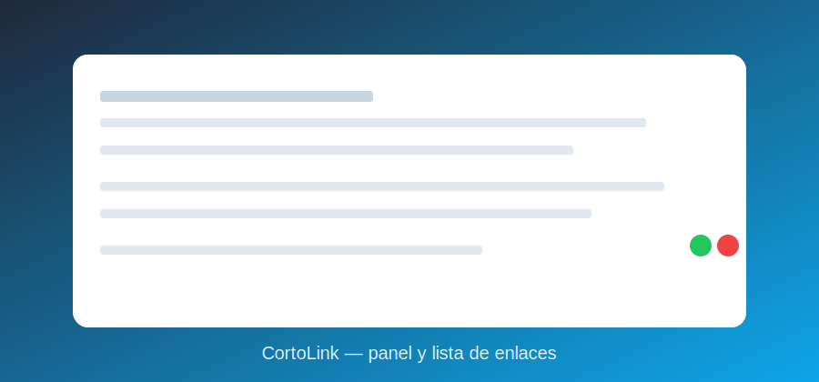

# CortoLink — Acortador de URLs con estadísticas (100% en español)

Proyecto **profesional y didáctico** para tu perfil: un **acortador de URLs** con
**redirección 302** y **estadísticas de clics** (referer, user-agent, IP y timestamp).
Todo en **español**, con **Express + Prisma (SQLite)** y una **UI** para admin.



## 🚀 Arranque rápido
```powershell
Copy-Item .env.example .env   # en Bash: cp .env.example .env
npm install
npx prisma generate
npx prisma migrate dev --name init
npm run dev
```
- Home: `http://localhost:3000/` (crear enlaces)
- Admin: `http://localhost:3000/admin` (pedirá usuario/contraseña)

## 🔐 Acceso administrador
`.env`:
```
ADMIN_USER=admin
ADMIN_PASS=admin123
```
Se usa **HTTP Basic Auth** para `/admin` y `/api/admin/*`.

## 📚 Endpoints
**Públicos**
- `POST /api/links` — Body: `{ "urlOriginal": "https://..." , "slug": "opcional" }`
- `GET /:slug` — Redirige 302 y registra clic.

**Admin (Basic Auth)**
- `GET /api/admin/links`
- `GET /api/admin/links/:id/stats`
- `DELETE /api/admin/links/:id`

## 🗃️ Datos (Prisma/SQLite)
- `Link { id, slug, urlOriginal, creadoEn, clics[] }`
- `Click { id, linkId, ts, referer?, userAgent?, ip? }`

## 📦 Scripts
- `npm run dev`, `npm run seed`, `npm run prisma:studio`, `npm run prisma:format`

## 📝 Licencia
MIT
